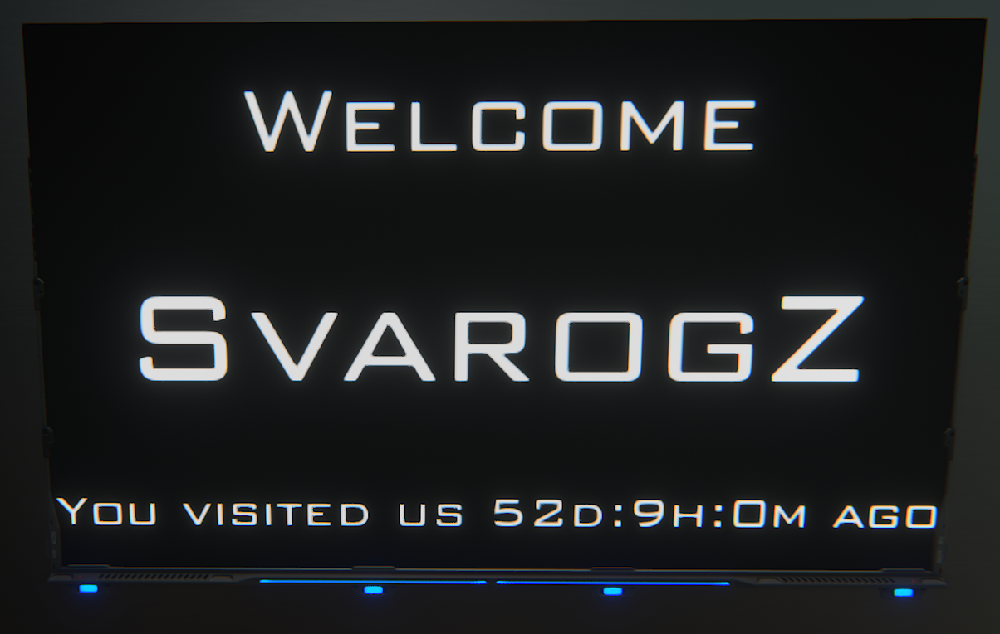
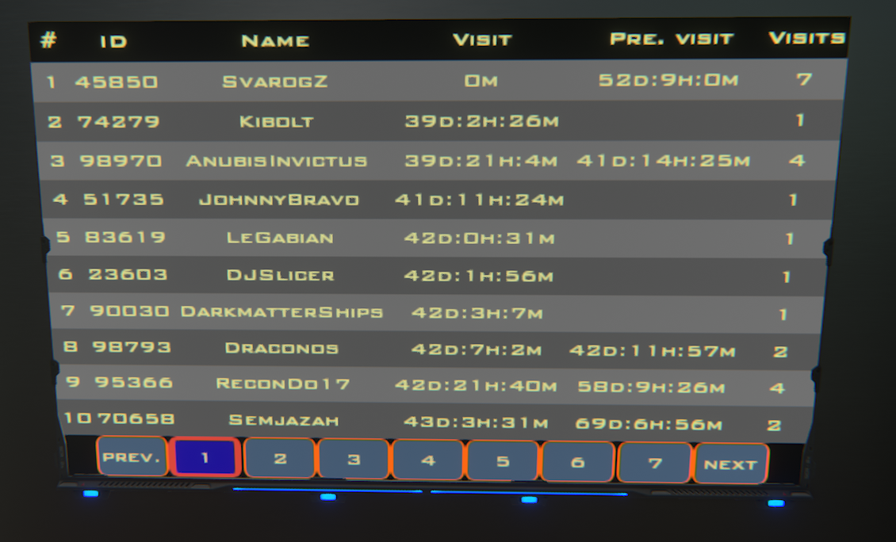

# DU-Welcome-Screen
Dual Universe welcome screen with user registration

Connect one data bank and two screens to the programming board.
Connect a zone detector or relay linking all zone detectors to start the programming board.

The first screen is used as a welcome screen.
The second screen shows statistic.

Copy welcome-screen.json content to the clipboard.
Pase lua configuration from clipboard to the programming board.
*Note:* both connected screens are clickable. Delete mouseDown event from the "Welcome" screen.

**OR**

Copy-paste the code to the **unit.start**.
Cut the code starting from
```
-------------------------------
---- SCREEN EVENT -------------
-------------------------------
--mouseDown(*,*) event --------
-------------------------------
```
and past it to the event filter of the second screen (with the highest id number) or to both screens if you don't know which one is the second.



